## EXECUTIVE SUMMARY

### PROJECT OVERVIEW

ERM Experts, a leader in enterprise risk management consulting, seeks a revolutionary digital platform to transform organizational risk assessment and monitoring. The proposed solution is a comprehensive, user-friendly system that will streamline the creation, updating, and oversight of risk registers across all levels of an organization. This innovative platform will feature:

- Intuitive risk input and categorization
- Automated risk ranking based on likelihood and impact
- Dynamic heat map visualization for rapid risk prioritization
- Advanced reporting and analytics with customizable dashboards
- Trend analysis capabilities for informed decision-making

By centralizing risk data and automating critical processes, this solution will empower ERM Experts' clients to proactively manage risks and enhance organizational resilience in today's fast-paced business landscape.

### OBJECTIVES

1. Develop a user-friendly, web-based risk management platform
2. Implement automated risk assessment and prioritization features
3. Create dynamic visualization tools, including heat maps and customizable dashboards
4. Integrate robust reporting and analytics capabilities
5. Ensure scalability to accommodate organizations of various sizes and industries
6. Provide a centralized repository for all risk-related data
7. Enable real-time collaboration and communication among stakeholders

### VALUE PROPOSITION

Our agency offers unique advantages for this project:

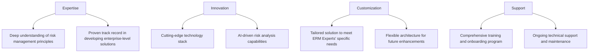

By leveraging our expertise in both risk management and software development, we will deliver a solution that not only meets but exceeds ERM Experts' expectations. Our innovative approach, coupled with a commitment to customization and ongoing support, ensures that the final product will be a game-changer in the enterprise risk management industry.

## PROJECT OBJECTIVES

### BUSINESS GOALS

1. Enhance risk management efficiency across client organizations
2. Improve decision-making through data-driven insights
3. Increase client retention and acquisition for ERM Experts
4. Reduce overall risk exposure for client organizations
5. Streamline compliance and reporting processes

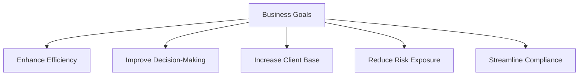

### TECHNICAL GOALS

1. Develop a scalable, cloud-based risk management platform
2. Implement robust data security and privacy measures
3. Create an intuitive, responsive user interface
4. Integrate machine learning algorithms for risk analysis and prediction
5. Establish real-time data synchronization and collaboration features
6. Develop APIs for seamless integration with existing client systems
7. Implement automated backup and disaster recovery systems

| Goal | Description |
|------|-------------|
| Scalability | Support concurrent users from small businesses to large enterprises |
| Security | Implement end-to-end encryption and role-based access control |
| User Interface | Design a responsive, accessible interface compatible with various devices |
| Machine Learning | Develop algorithms for risk trend analysis and predictive modeling |
| Real-time Collaboration | Enable simultaneous editing and instant updates across user sessions |
| API Integration | Create RESTful APIs for data exchange with external systems |
| Data Resilience | Implement automated backups and multi-region failover capabilities |

### SUCCESS CRITERIA

1. User Adoption and Satisfaction
   - Achieve 90% user adoption rate within client organizations
   - Maintain a user satisfaction score of 4.5/5 or higher

2. Performance Metrics
   - 99.9% system uptime during business hours
   - Page load times under 2 seconds for 95% of requests
   - Support for up to 10,000 concurrent users without performance degradation

3. Risk Management Effectiveness
   - Reduce time spent on risk assessment processes by 50%
   - Increase identification of potential risks by 30%
   - Improve risk mitigation response time by 40%

4. Business Impact for ERM Experts
   - Increase client retention rate to 95%
   - Acquire 25% more new clients within the first year of platform launch
   - Achieve 20% year-over-year revenue growth

5. Compliance and Reporting
   - Reduce time required for generating compliance reports by 60%
   - Achieve 100% accuracy in automated risk calculations and rankings

6. Data Security and Privacy
   - Zero data breaches or unauthorized access incidents
   - 100% compliance with relevant data protection regulations (e.g., GDPR, CCPA)

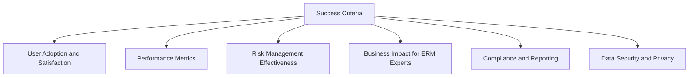

## SCOPE OF WORK

### IN-SCOPE

1. Web-based Risk Management Platform
   - Responsive design for desktop and mobile devices
   - User authentication and role-based access control
   - Multi-tenant architecture to support multiple client organizations

2. Risk Input and Categorization
   - Intuitive risk entry forms with customizable fields
   - Hierarchical risk categorization system
   - Bulk import/export functionality for risk data

3. Automated Risk Assessment
   - Configurable risk assessment matrices
   - Automated risk ranking based on likelihood and impact
   - Historical tracking of risk assessments

4. Dynamic Visualization
   - Interactive heat maps for risk prioritization
   - Customizable dashboards with drag-and-drop widgets
   - Real-time data updates and refreshes

5. Reporting and Analytics
   - Standard report templates (e.g., top risks, risk trends, mitigation status)
   - Custom report builder with export options (PDF, Excel, CSV)
   - Advanced analytics with filtering and drill-down capabilities

6. Collaboration Tools
   - Comment and discussion threads on individual risks
   - Task assignment and tracking for risk mitigation actions
   - Notification system for risk updates and approaching deadlines

7. Integration Capabilities
   - RESTful API for data exchange with external systems
   - Single Sign-On (SSO) integration
   - Webhook support for real-time event notifications

8. Data Security and Compliance
   - End-to-end encryption for data at rest and in transit
   - Audit logs for all user actions and system changes
   - Compliance with GDPR, CCPA, and other relevant regulations

9. Training and Support
   - Comprehensive user documentation and help center
   - Admin panel for client-specific configurations
   - Tier 1 support for end-users and dedicated support for ERM Experts staff

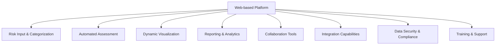

### OUT-OF-SCOPE

1. Hardware provisioning or on-premises installations
2. Custom integrations with specific client legacy systems
3. Development of mobile applications (native iOS or Android apps)
4. Provision of risk management consulting services
5. Legal advice or interpretation of compliance requirements
6. Data migration from existing client systems
7. Customization of risk assessment methodologies beyond configurable options
8. Continuous monitoring of external data sources for automatic risk identification
9. Artificial Intelligence-driven risk prediction (future enhancement)

### ASSUMPTIONS

1. ERM Experts will provide subject matter expertise on risk management processes and requirements
2. Client organizations have modern web browsers capable of running the application
3. Users have basic computer literacy and familiarity with web-based applications
4. Internet connectivity is available for all end-users
5. ERM Experts will handle client onboarding and first-line support
6. Third-party services (e.g., cloud hosting, email delivery) will maintain their service level agreements
7. Client data will be stored in compliant data centers within their respective regions
8. ERM Experts will provide necessary testing resources during User Acceptance Testing (UAT)
9. The project will follow an agile development methodology with regular client feedback

### DEPENDENCIES

| Dependency | Description | Impact |
|------------|-------------|--------|
| Cloud Infrastructure | Selection and setup of cloud hosting provider (e.g., AWS, Azure, GCP) | Affects system architecture, scalability, and security implementation |
| Third-party Libraries | Integration of charting libraries for data visualization | May influence UI/UX design and performance optimization |
| SSL Certificates | Procurement and renewal of SSL certificates for secure communications | Critical for maintaining data security and user trust |
| Email Service Provider | Integration with a reliable email service for notifications | Affects user communication and system alerts |
| Payment Gateway | If applicable, integration with a payment system for subscription management | Impacts billing and access control features |
| Data Protection Regulations | Ongoing compliance with evolving data protection laws | May require periodic updates to data handling processes |
| Client Feedback | Timely input and approval from ERM Experts on key features and designs | Could affect project timeline and final deliverables |
| External Audits | If required, scheduling and completion of security audits | May impact go-live date and require additional development cycles |

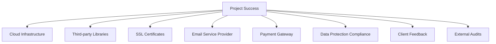

## BUDGET AND COST ESTIMATES

### COST BREAKDOWN

The following table provides a detailed breakdown of the project costs:

| Category | Description | Cost (USD) |
|----------|-------------|------------|
| Labor | Development Team (4 developers, 1 designer, 1 project manager) | $480,000 |
| | Quality Assurance (2 QA specialists) | $120,000 |
| | DevOps Engineer | $90,000 |
| | Security Specialist | $80,000 |
| Infrastructure | Cloud Hosting (AWS, 12 months) | $60,000 |
| | SSL Certificates | $1,000 |
| | Third-party Services (Email, Analytics, etc.) | $12,000 |
| Software Licenses | Development Tools and Libraries | $15,000 |
| | Monitoring and Logging Tools | $8,000 |
| Training and Documentation | User Guide Creation | $10,000 |
| | Training Materials Development | $15,000 |
| Contingency | 10% of total budget | $89,100 |
| **Total** | | **$980,100** |

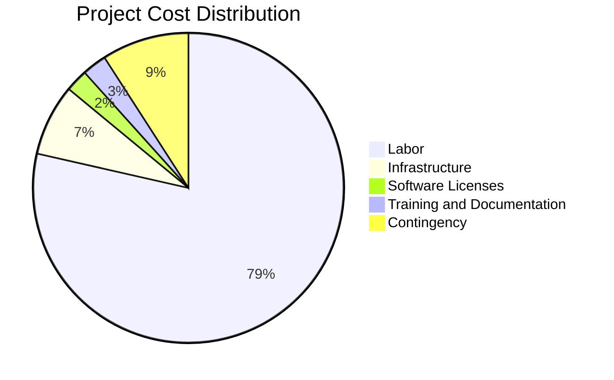

### PAYMENT SCHEDULE

The proposed payment schedule is tied to project milestones and deliverables:

| Milestone | Deliverable | Payment (% of Total) | Amount (USD) |
|-----------|-------------|----------------------|--------------|
| Project Kickoff | Signed contract and project initiation | 20% | $196,020 |
| Requirements Finalization | Approved requirements document | 10% | $98,010 |
| Design Approval | Signed off UI/UX designs and system architecture | 15% | $147,015 |
| Alpha Release | Functional prototype with core features | 20% | $196,020 |
| Beta Release | Feature-complete version for UAT | 15% | $147,015 |
| Go-Live | Production deployment and handover | 15% | $147,015 |
| Final Acceptance | Project closure after 30 days of stable operation | 5% | $49,005 |

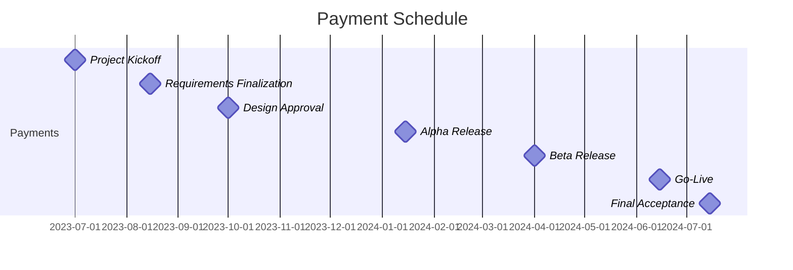

### BUDGET CONSIDERATIONS

1. Scope Changes: Any significant changes to the project scope may impact the budget. We will manage this through a formal change request process, evaluating the impact on time and cost before approval.

2. Technology Risks: Unforeseen technical challenges or the need for additional third-party services could increase costs. We have included a contingency budget to address such issues.

3. Timeline Extensions: Delays in project milestones could lead to increased labor costs. We will mitigate this risk through rigorous project management and regular progress reviews.

4. Scalability Requirements: If the system needs to handle a significantly larger user base than initially anticipated, additional infrastructure costs may be incurred. We will design the system with scalability in mind to minimize potential impacts.

5. Security and Compliance: Evolving data protection regulations or security requirements may necessitate additional development or third-party services. Our security specialist will monitor these aspects throughout the project.

6. Exchange Rate Fluctuations: For any international vendors or services, currency exchange rate changes could affect costs. We will use fixed-rate contracts where possible to mitigate this risk.

7. Client Feedback Cycles: Extended review and feedback cycles from ERM Experts could impact the development timeline and, consequently, the budget. We will establish clear communication protocols and deadlines for feedback to manage this risk.

8. Training and Support: If additional training or support is required beyond the initial scope, it may incur extra costs. We have allocated budget for comprehensive documentation and training materials to minimize this risk.

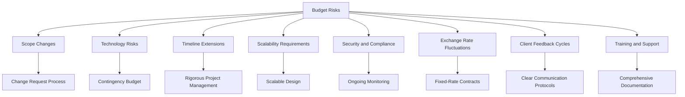

To manage these budget considerations effectively, we will:

1. Conduct regular budget reviews and forecasts
2. Maintain transparent communication with ERM Experts about potential budget impacts
3. Prioritize features to ensure core functionality is delivered within budget constraints
4. Leverage agile development methodologies to adapt to changes efficiently
5. Continuously monitor and optimize resource allocation throughout the project lifecycle

## TIMELINE AND MILESTONES

### PROJECT TIMELINE

The project is estimated to take 12 months from initiation to completion. The high-level timeline is as follows:

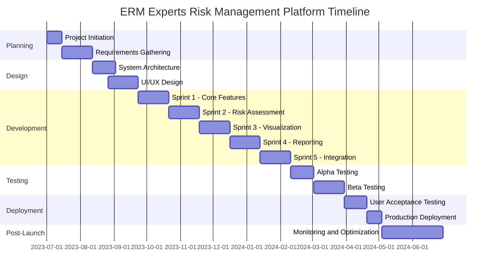

### KEY MILESTONES

| Milestone | Description | Target Date |
|-----------|-------------|-------------|
| M1: Project Kickoff | Contract signed, project team assembled | 2023-07-01 |
| M2: Requirements Approval | Finalized and approved requirements document | 2023-08-12 |
| M3: Design Signoff | Approved system architecture and UI/UX designs | 2023-09-23 |
| M4: Alpha Release | Core functionality implemented and ready for internal testing | 2024-02-10 |
| M5: Beta Release | Feature-complete version ready for client testing | 2024-03-02 |
| M6: UAT Completion | User Acceptance Testing completed with client approval | 2024-04-20 |
| M7: Go-Live | Production deployment and system handover | 2024-05-04 |
| M8: Project Closure | Final acceptance after 30 days of stable operation | 2024-06-29 |

### CRITICAL PATH

The following tasks and activities are critical to keeping the project on schedule:

1. Requirements Gathering and Approval
   - Delay in finalizing requirements will impact all subsequent phases

2. System Architecture Design
   - Critical for establishing the foundation of the platform

3. Core Feature Development (Sprint 1)
   - Essential functionality must be completed before moving to advanced features

4. Risk Assessment Module Development (Sprint 2)
   - Key component of the platform that other features depend on

5. Data Visualization Implementation (Sprint 3)
   - Critical for delivering the heat map and dashboard functionalities

6. Alpha and Beta Testing
   - Crucial for identifying and resolving issues before UAT

7. User Acceptance Testing
   - Final client approval before go-live

8. Production Deployment
   - Careful execution required to ensure smooth transition to live environment

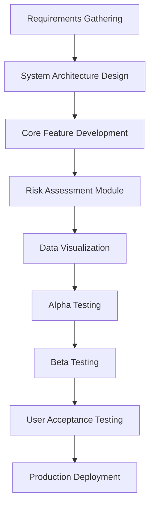

To maintain the project timeline, we will:

1. Conduct daily stand-ups to quickly identify and address any blockers
2. Use agile methodologies to adapt to changes and maintain progress
3. Implement parallel development tracks where possible to optimize time
4. Maintain open communication channels with ERM Experts for quick decision-making
5. Regularly review and update the project timeline to reflect actual progress and adjust as needed

By focusing on these critical path items and employing proactive project management techniques, we aim to deliver the ERM Experts Risk Management Platform on time and within budget.

## DELIVERABLES

### LIST OF DELIVERABLES

1. Software Components
   - Web-based Risk Management Platform
   - User Authentication and Access Control Module
   - Risk Input and Categorization Module
   - Automated Risk Assessment Engine
   - Dynamic Visualization Tools (Heat Maps and Dashboards)
   - Reporting and Analytics Module
   - Collaboration and Notification System
   - API for External Integrations

2. Documentation
   - System Architecture Document
   - User Manual
   - Administrator Guide
   - API Documentation
   - Data Security and Compliance Guide

3. Training Materials
   - End-User Training Videos
   - Administrator Training Guide
   - Quick Start Guide
   - Interactive Online Tutorial

4. Additional Deliverables
   - Source Code Repository
   - Deployment Scripts and Configuration Files
   - Test Cases and Test Results
   - Performance Benchmark Reports

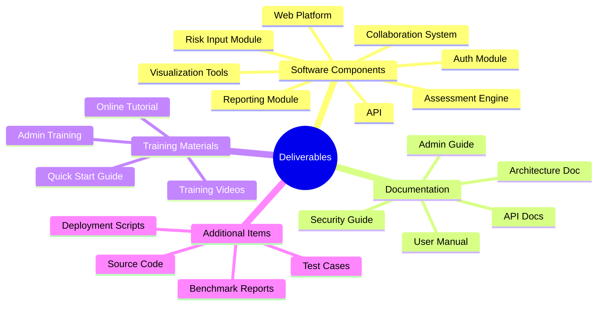

### DELIVERY SCHEDULE

| Deliverable | Expected Delivery Date |
|-------------|------------------------|
| System Architecture Document | 2023-09-15 |
| User Authentication Module | 2023-10-20 |
| Risk Input and Categorization Module | 2023-11-17 |
| Automated Risk Assessment Engine | 2023-12-15 |
| Dynamic Visualization Tools | 2024-01-12 |
| Reporting and Analytics Module | 2024-02-09 |
| Collaboration and Notification System | 2024-03-08 |
| API for External Integrations | 2024-03-29 |
| User Manual (Draft) | 2024-04-05 |
| Administrator Guide (Draft) | 2024-04-12 |
| API Documentation | 2024-04-19 |
| Data Security and Compliance Guide | 2024-04-26 |
| End-User Training Videos | 2024-05-03 |
| Administrator Training Guide | 2024-05-10 |
| Quick Start Guide | 2024-05-17 |
| Interactive Online Tutorial | 2024-05-24 |
| Final User Manual | 2024-05-31 |
| Final Administrator Guide | 2024-05-31 |
| Source Code Repository | 2024-06-07 |
| Deployment Scripts and Configuration Files | 2024-06-14 |
| Test Cases and Test Results | 2024-06-21 |
| Performance Benchmark Reports | 2024-06-28 |

### ACCEPTANCE CRITERIA

1. Software Components
   - All features function as specified in the requirements document
   - Performance meets or exceeds specified benchmarks (e.g., response times, concurrent users)
   - Passes all security and penetration tests
   - Compatible with specified browsers and devices
   - Meets accessibility standards (WCAG 2.1 AA)

2. Documentation
   - Comprehensive coverage of all system features and functions
   - Clear, concise, and free of technical errors
   - Includes all necessary diagrams, screenshots, and examples
   - Adheres to agreed-upon style guide and formatting standards

3. Training Materials
   - Covers all essential user and administrator tasks
   - Clarity and effectiveness validated through user testing
   - Compatible with specified delivery platforms (e.g., LMS, video hosting)
   - Includes assessments to verify user comprehension

4. Additional Deliverables
   - Source code passes static analysis and adheres to coding standards
   - Deployment scripts successfully set up the system in test environment
   - Test cases cover at least 90% of code and critical user paths
   - Benchmark reports demonstrate system meets or exceeds performance requirements

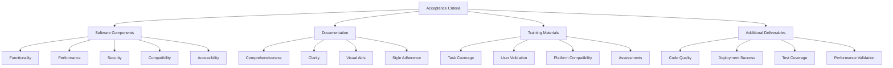

Each deliverable will be subject to a formal review process involving key stakeholders from both the development team and ERM Experts. Acceptance will be granted only when all criteria are met and any identified issues are resolved to the client's satisfaction.