# INTRODUCTION

## PURPOSE

The purpose of this Software Requirements Specification (SRS) document is to provide a comprehensive and detailed description of the Enterprise Risk Management (ERM) platform being developed for ERM Experts. This document serves as the primary reference for all stakeholders involved in the project, including:

1. ERM Experts management and staff
2. Development team members
3. Quality assurance testers
4. Project managers
5. User experience designers
6. System architects
7. Potential end-users from client organizations

This SRS aims to:

- Clearly define the functional and non-functional requirements of the ERM platform
- Establish a shared understanding of the project scope and objectives
- Provide a basis for estimating costs, resources, and timelines
- Serve as a contractual basis for the development process
- Guide the design, development, and testing phases of the project

By thoroughly documenting the requirements, this SRS will help ensure that all parties have a clear and consistent vision of the final product, minimizing misunderstandings and reducing the risk of scope creep or missed expectations.

## SCOPE

The ERM platform is a cutting-edge, web-based solution designed to revolutionize how organizations handle risk assessment and monitoring. This comprehensive system will empower businesses to proactively manage risks, enhance organizational resilience, and stay ahead in today's dynamic business environment.

### Goals

1. Streamline the creation, updating, and oversight of risk registers across all levels of an organization
2. Automate risk assessment and prioritization processes
3. Provide real-time, visual representations of risk data for quick decision-making
4. Enhance collaboration and communication among stakeholders in the risk management process
5. Offer robust reporting and analytics capabilities to support informed decision-making
6. Ensure compliance with relevant risk management standards and regulations

### Benefits

1. Increased efficiency in risk management processes
2. Improved accuracy and consistency in risk assessments
3. Enhanced visibility of organizational risk landscape
4. Better allocation of resources for risk mitigation
5. Facilitated compliance with regulatory requirements
6. Improved organizational resilience and decision-making

### Core Functionalities

1. User Authentication and Role-based Access Control
   - Secure login system
   - Customizable user roles and permissions

2. Risk Input and Categorization
   - Intuitive risk entry forms with customizable fields
   - Hierarchical risk categorization system
   - Bulk import/export functionality

3. Automated Risk Assessment
   - Configurable risk assessment matrices
   - Automated risk ranking based on likelihood and impact
   - Historical tracking of risk assessments

4. Dynamic Visualization
   - Interactive heat maps for risk prioritization
   - Customizable dashboards with drag-and-drop widgets
   - Real-time data updates and refreshes

5. Reporting and Analytics
   - Standard report templates
   - Custom report builder with export options
   - Advanced analytics with filtering and drill-down capabilities

6. Collaboration Tools
   - Comment and discussion threads on individual risks
   - Task assignment and tracking for risk mitigation actions
   - Notification system for risk updates and approaching deadlines

7. Integration Capabilities
   - RESTful API for data exchange with external systems
   - Single Sign-On (SSO) integration
   - Webhook support for real-time event notifications

8. Data Security and Compliance
   - End-to-end encryption for data at rest and in transit
   - Audit logs for all user actions and system changes
   - Compliance with GDPR, CCPA, and other relevant regulations

The ERM platform will be developed as a responsive web application, ensuring accessibility across desktop and mobile devices. It will leverage modern web technologies and frameworks to deliver a seamless, high-performance user experience while maintaining robust security and scalability.

By providing a centralized, user-friendly solution for enterprise risk management, this platform will enable organizations to make data-driven decisions, mitigate potential threats, and capitalize on opportunities in an increasingly complex business landscape.

# PRODUCT DESCRIPTION

## PRODUCT PERSPECTIVE

The Enterprise Risk Management (ERM) platform is a comprehensive, web-based solution designed to revolutionize how organizations handle risk assessment and monitoring. It operates as a standalone system that can be integrated into existing enterprise environments through its robust API. The platform is built to be cloud-native, leveraging modern web technologies and frameworks to deliver a seamless, high-performance user experience while maintaining robust security and scalability.

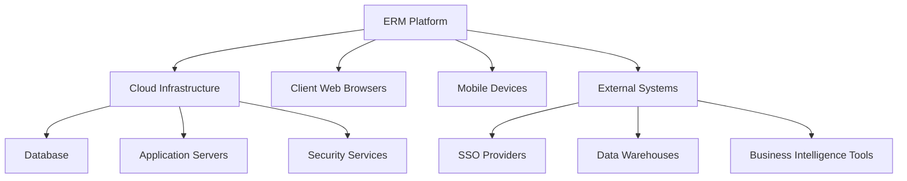

The ERM platform interacts with various components and systems:

1. Cloud Infrastructure: Hosted on a scalable cloud platform (e.g., AWS, Azure, or GCP) to ensure high availability and performance.
2. Client Web Browsers: The primary interface for users, supporting modern browsers across desktop and mobile devices.
3. Mobile Devices: Responsive design ensures accessibility from smartphones and tablets.
4. External Systems: Integrates with existing enterprise systems through RESTful APIs and webhooks.
5. Single Sign-On (SSO) Providers: Supports integration with popular SSO solutions for seamless authentication.
6. Data Warehouses and Business Intelligence Tools: Allows data export and integration for advanced analytics and reporting.

## PRODUCT FUNCTIONS

The ERM platform provides a wide range of functions to support comprehensive risk management:

1. User Authentication and Role-based Access Control
   - Secure login system with multi-factor authentication
   - Customizable user roles and permissions

2. Risk Input and Categorization
   - Intuitive risk entry forms with customizable fields
   - Hierarchical risk categorization system
   - Bulk import/export functionality

3. Automated Risk Assessment
   - Configurable risk assessment matrices
   - Automated risk ranking based on likelihood and impact
   - Historical tracking of risk assessments

4. Dynamic Visualization
   - Interactive heat maps for risk prioritization
   - Customizable dashboards with drag-and-drop widgets
   - Real-time data updates and refreshes

5. Reporting and Analytics
   - Standard report templates
   - Custom report builder with export options
   - Advanced analytics with filtering and drill-down capabilities

6. Collaboration Tools
   - Comment and discussion threads on individual risks
   - Task assignment and tracking for risk mitigation actions
   - Notification system for risk updates and approaching deadlines

7. Integration Capabilities
   - RESTful API for data exchange with external systems
   - Single Sign-On (SSO) integration
   - Webhook support for real-time event notifications

8. Data Security and Compliance
   - End-to-end encryption for data at rest and in transit
   - Audit logs for all user actions and system changes
   - Compliance with GDPR, CCPA, and other relevant regulations

## USER CHARACTERISTICS

The ERM platform is designed to cater to a diverse range of users within an organization:

1. Risk Managers
   - Expertise: High level of risk management knowledge
   - Responsibilities: Overseeing the entire risk management process, configuring risk assessment criteria, and generating high-level reports
   - Persona: Sarah, a seasoned risk manager with 15 years of experience, needs a comprehensive view of the organization's risk landscape

2. Department Heads
   - Expertise: Moderate risk management knowledge, high domain expertise
   - Responsibilities: Inputting and managing risks specific to their department, assigning mitigation tasks
   - Persona: Mark, an IT Director, requires a clear view of technology-related risks and the ability to delegate risk mitigation tasks

3. Executive Leadership
   - Expertise: High-level understanding of risk management principles
   - Responsibilities: Reviewing high-priority risks, making strategic decisions based on risk data
   - Persona: Elena, the CEO, needs quick access to critical risk information through intuitive dashboards

4. Risk Owners
   - Expertise: Varies, but typically moderate domain knowledge
   - Responsibilities: Updating specific risks, implementing mitigation strategies
   - Persona: Alex, a project manager, needs to regularly update project-related risks and track mitigation efforts

5. Auditors
   - Expertise: High level of compliance and auditing knowledge
   - Responsibilities: Reviewing risk management processes, ensuring compliance
   - Persona: David, an external auditor, requires comprehensive access to risk data and audit trails

6. System Administrators
   - Expertise: High level of technical knowledge
   - Responsibilities: Managing user accounts, configuring system settings, maintaining integrations
   - Persona: Lisa, an IT systems specialist, needs powerful admin tools to manage the platform effectively

## CONSTRAINTS

1. Technical Constraints
   - Must be compatible with modern web browsers (Chrome, Firefox, Safari, Edge)
   - Mobile responsiveness required for all core functions
   - Maximum page load time of 2 seconds for 95% of requests
   - Must support a minimum of 10,000 concurrent users

2. Regulatory Constraints
   - Compliance with GDPR, CCPA, and other relevant data protection regulations
   - Adherence to industry-specific regulations (e.g., SOX, HIPAA) as applicable to clients

3. Security Constraints
   - Implementation of end-to-end encryption for all data
   - Multi-factor authentication support
   - Regular security audits and penetration testing required

4. Integration Constraints
   - API must be RESTful and follow OpenAPI 3.0 specifications
   - Support for SAML 2.0 and OAuth 2.0 for SSO integration

5. Usability Constraints
   - User interface must comply with WCAG 2.1 AA accessibility standards
   - System must support multiple languages and locales

6. Data Constraints
   - Data retention policies must be configurable to meet various regulatory requirements
   - Support for data segregation in multi-tenant environments

7. Performance Constraints
   - 99.9% uptime SLA during business hours
   - Ability to handle up to 1 million risk entries per organization

8. Budgetary Constraints
   - Development and first-year operational costs must not exceed $980,100 as outlined in the budget section

## ASSUMPTIONS AND DEPENDENCIES

### Assumptions

1. Users have access to modern web browsers and stable internet connections
2. Client organizations have basic IT infrastructure to support user access and data management
3. ERM Experts will provide subject matter expertise on risk management processes throughout the development
4. Users have basic computer literacy and familiarity with web-based applications
5. The project will follow an agile development methodology with regular client feedback
6. Client data will primarily be in English, with future support for additional languages

### Dependencies

1. Cloud Infrastructure: Selection and setup of cloud hosting provider (e.g., AWS, Azure, GCP)
2. Third-party Libraries: Integration of charting libraries for data visualization (e.g., D3.js, Chart.js)
3. SSL Certificates: Procurement and renewal of SSL certificates for secure communications
4. Email Service Provider: Integration with a reliable email service for notifications (e.g., SendGrid, Amazon SES)
5. Payment Gateway: If applicable, integration with a payment system for subscription management
6. Data Protection Regulations: Ongoing compliance with evolving data protection laws
7. Client Feedback: Timely input and approval from ERM Experts on key features and designs
8. External Audits: If required, scheduling and completion of security audits
9. Development Tools: Access to necessary development and testing tools (e.g., IDEs, testing frameworks)
10. Continuous Integration/Continuous Deployment (CI/CD) Pipeline: Setup and maintenance of automated build and deployment processes

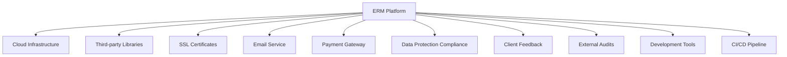

By clearly defining these aspects of the product description, we ensure a comprehensive understanding of the ERM platform's context, functionality, target users, limitations, and critical dependencies. This information will guide the development process and help manage stakeholder expectations throughout the project lifecycle.

## PROCESS FLOWCHART

The following process flowcharts illustrate the key workflows within the ERM platform:

### User Authentication and Access

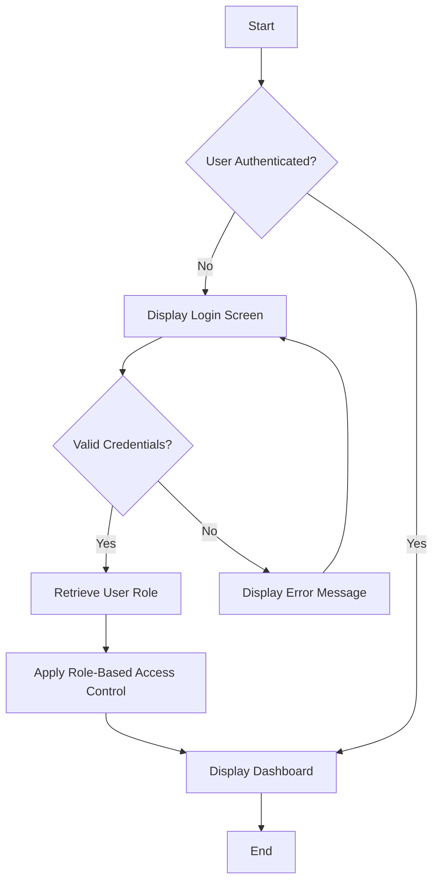

### Risk Input and Assessment

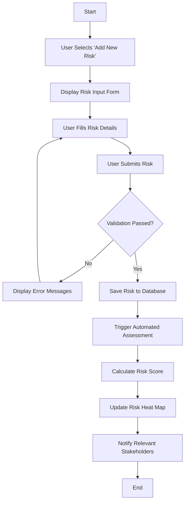

### Reporting and Analytics

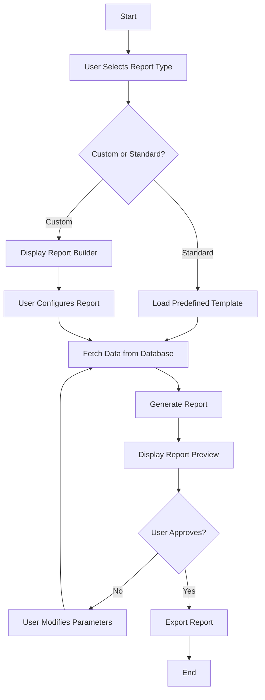

### Collaboration and Task Management

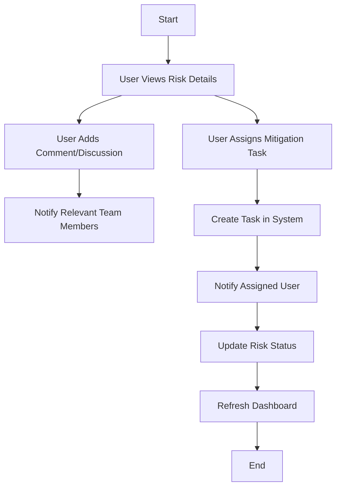

### Integration with External Systems

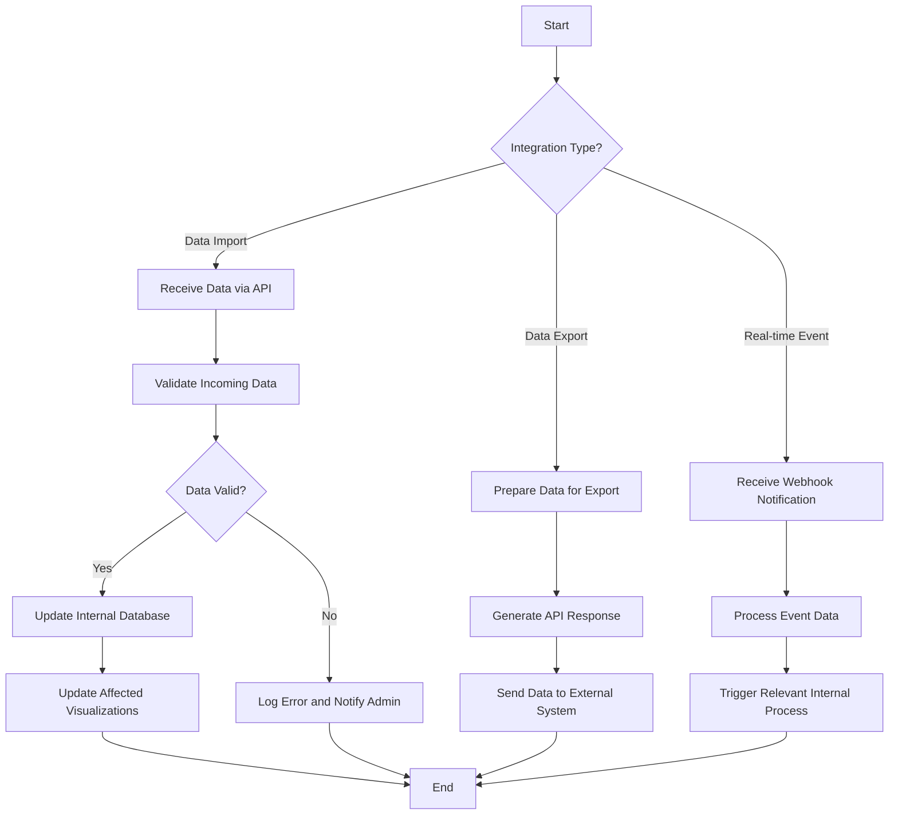

These process flowcharts provide a high-level overview of the key workflows within the ERM platform. They illustrate the logical flow of actions and decisions for core functionalities such as user authentication, risk input and assessment, reporting, collaboration, and system integration. These workflows will be implemented using the modern web technologies and frameworks chosen for the project, ensuring a seamless and efficient user experience.

Here's a breakdown of the ERM platform into features, maintaining consistency with previous technology and framework choices mentioned in the document:

1. User Authentication and Access Control

ID: F001
DESCRIPTION: Secure login system with multi-factor authentication and role-based access control.
PRIORITY: High

| Requirement ID | Requirement Description |
|----------------|--------------------------|
| F001-1 | Implement secure user authentication using industry-standard protocols (e.g., OAuth 2.0) |
| F001-2 | Support multi-factor authentication for enhanced security |
| F001-3 | Implement role-based access control with customizable user roles and permissions |
| F001-4 | Integrate with Single Sign-On (SSO) providers |
| F001-5 | Maintain an audit log of all authentication and access control events |

2. Risk Input and Categorization

ID: F002
DESCRIPTION: Intuitive risk entry forms with customizable fields and hierarchical risk categorization system.
PRIORITY: High

| Requirement ID | Requirement Description |
|----------------|--------------------------|
| F002-1 | Provide user-friendly forms for risk data entry with customizable fields |
| F002-2 | Implement a hierarchical risk categorization system |
| F002-3 | Support bulk import/export functionality for risk data |
| F002-4 | Allow attachment of supporting documents to risk entries |
| F002-5 | Implement real-time validation of risk data input |

3. Automated Risk Assessment

ID: F003
DESCRIPTION: Configurable risk assessment matrices with automated risk ranking based on likelihood and impact.
PRIORITY: High

| Requirement ID | Requirement Description |
|----------------|--------------------------|
| F003-1 | Provide configurable risk assessment matrices |
| F003-2 | Implement automated risk ranking based on likelihood and impact |
| F003-3 | Support historical tracking of risk assessments |
| F003-4 | Allow customization of assessment criteria and scoring methods |
| F003-5 | Generate automated notifications for high-priority risks |

4. Dynamic Visualization

ID: F004
DESCRIPTION: Interactive heat maps and customizable dashboards with real-time data updates.
PRIORITY: Medium

| Requirement ID | Requirement Description |
|----------------|--------------------------|
| F004-1 | Develop interactive heat maps for risk prioritization |
| F004-2 | Create customizable dashboards with drag-and-drop widgets |
| F004-3 | Implement real-time data updates and refreshes |
| F004-4 | Support various chart types (e.g., bar charts, pie charts, line graphs) |
| F004-5 | Allow users to save and share custom dashboard configurations |

5. Reporting and Analytics

ID: F005
DESCRIPTION: Standard report templates, custom report builder, and advanced analytics capabilities.
PRIORITY: Medium

| Requirement ID | Requirement Description |
|----------------|--------------------------|
| F005-1 | Provide standard report templates (e.g., top risks, risk trends, mitigation status) |
| F005-2 | Develop a custom report builder with export options (PDF, Excel, CSV) |
| F005-3 | Implement advanced analytics with filtering and drill-down capabilities |
| F005-4 | Support scheduling and automated distribution of reports |
| F005-5 | Integrate with popular business intelligence tools for extended analysis |

6. Collaboration Tools

ID: F006
DESCRIPTION: Comment threads, task assignment, and notification system for risk management collaboration.
PRIORITY: Medium

| Requirement ID | Requirement Description |
|----------------|--------------------------|
| F006-1 | Implement comment and discussion threads on individual risks |
| F006-2 | Develop task assignment and tracking for risk mitigation actions |
| F006-3 | Create a notification system for risk updates and approaching deadlines |
| F006-4 | Support @mentions and team collaboration features |
| F006-5 | Implement an activity feed to track changes and updates |

7. Integration Capabilities

ID: F007
DESCRIPTION: RESTful API, SSO integration, and webhook support for external system integration.
PRIORITY: Low

| Requirement ID | Requirement Description |
|----------------|--------------------------|
| F007-1 | Develop a RESTful API for data exchange with external systems |
| F007-2 | Implement Single Sign-On (SSO) integration |
| F007-3 | Provide webhook support for real-time event notifications |
| F007-4 | Create documentation for API endpoints and integration methods |
| F007-5 | Implement rate limiting and security measures for API access |

8. Data Security and Compliance

ID: F008
DESCRIPTION: End-to-end encryption, audit logs, and compliance with relevant data protection regulations.
PRIORITY: High

| Requirement ID | Requirement Description |
|----------------|--------------------------|
| F008-1 | Implement end-to-end encryption for data at rest and in transit |
| F008-2 | Maintain detailed audit logs for all user actions and system changes |
| F008-3 | Ensure compliance with GDPR, CCPA, and other relevant regulations |
| F008-4 | Implement data retention policies and secure data deletion mechanisms |
| F008-5 | Conduct regular security audits and penetration testing |

This feature breakdown maintains consistency with the previously mentioned modern web technologies and frameworks, such as responsive design for desktop and mobile devices, cloud-based infrastructure, and the use of RESTful APIs. The features are prioritized based on their importance to the core functionality of the ERM platform and aligned with the project objectives outlined earlier in the document.

# NON-FUNCTIONAL REQUIREMENTS

## PERFORMANCE

1. Response Time
   - Web pages must load within 2 seconds for 95% of requests under normal load conditions
   - API endpoints must respond within 500ms for 99% of requests
   - Real-time data updates must be pushed to clients within 1 second of the change

2. Throughput
   - The system must support at least 10,000 concurrent users without performance degradation
   - The platform must handle at least 1,000 risk assessments per minute during peak usage

3. Resource Usage
   - Database queries must execute in under 100ms for 95% of requests
   - CPU utilization should not exceed 70% under normal load conditions
   - Memory usage should not exceed 80% of available RAM under peak load

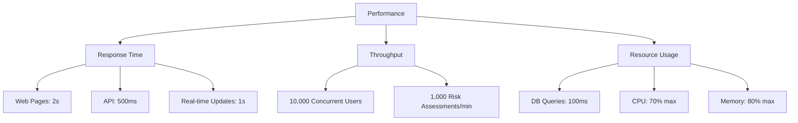

## SAFETY

1. Data Integrity
   - Implement transaction management to ensure data consistency in case of system failures
   - Perform daily automated database backups with a retention period of 30 days
   - Implement a disaster recovery plan with a Recovery Time Objective (RTO) of 4 hours and a Recovery Point Objective (RPO) of 1 hour

2. Error Handling
   - Implement comprehensive error logging and monitoring
   - Display user-friendly error messages without exposing sensitive system information
   - Implement automatic system alerts for critical errors and performance issues

3. Failover and Redundancy
   - Implement a multi-region deployment with automatic failover capabilities
   - Ensure no single point of failure in the system architecture
   - Conduct regular failover drills to verify system resilience

## SECURITY

1. Authentication
   - Implement multi-factor authentication (MFA) for all user accounts
   - Enforce strong password policies (minimum 12 characters, including uppercase, lowercase, numbers, and special characters)
   - Implement account lockout after 5 failed login attempts

2. Authorization
   - Implement role-based access control (RBAC) for all system functions
   - Enforce the principle of least privilege for all user roles
   - Implement API key authentication for external integrations

3. Data Encryption
   - Use TLS 1.3 for all data in transit
   - Implement AES-256 encryption for all data at rest
   - Use secure key management practices, including regular key rotation

4. Privacy
   - Implement data anonymization techniques for reporting and analytics
   - Provide user consent management for data collection and processing
   - Implement data retention policies in compliance with relevant regulations

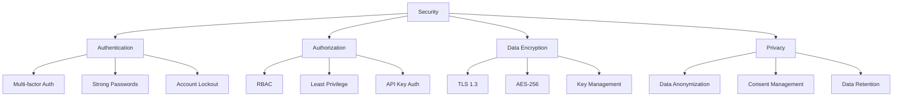

## QUALITY

1. Availability
   - Achieve 99.9% uptime during business hours (8am-8pm local time)
   - Implement automated health checks and self-healing mechanisms
   - Schedule maintenance windows during off-peak hours with advance notice to users

2. Maintainability
   - Follow clean code principles and maintain a code documentation coverage of at least 80%
   - Implement automated CI/CD pipelines for streamlined deployment and updates
   - Maintain comprehensive system documentation, including architecture diagrams and API specifications

3. Usability
   - Achieve a System Usability Scale (SUS) score of at least 80
   - Ensure the user interface is responsive and compatible with major browsers (Chrome, Firefox, Safari, Edge)
   - Implement keyboard navigation and screen reader support for accessibility (WCAG 2.1 AA compliance)

4. Scalability
   - Design the system to horizontally scale to handle up to 100,000 concurrent users
   - Implement database sharding to support organizations with over 1 million risk entries
   - Use cloud-native technologies to allow for dynamic resource allocation based on demand

5. Reliability
   - Achieve a Mean Time Between Failures (MTBF) of at least 720 hours (30 days)
   - Implement comprehensive automated testing with a minimum of 90% code coverage
   - Conduct regular load testing and stress testing to identify and address potential bottlenecks

## COMPLIANCE

1. Legal Compliance
   - Ensure compliance with GDPR for handling personal data of EU citizens
   - Comply with CCPA for California residents' data protection rights
   - Adhere to relevant local data protection laws in all operating jurisdictions

2. Regulatory Compliance
   - Implement controls to support SOX compliance for financial risk management
   - Ensure HIPAA compliance for healthcare industry clients (if applicable)
   - Support PCI DSS compliance for handling of payment information (if applicable)

3. Standards Compliance
   - Adhere to ISO 31000 Risk Management principles and guidelines
   - Comply with NIST Cybersecurity Framework for security best practices
   - Implement logging and auditing in compliance with ISO 27001 Information Security Management

4. Accessibility Compliance
   - Ensure WCAG 2.1 AA compliance for web accessibility
   - Support Section 508 compliance for U.S. federal agency clients (if applicable)

5. Industry-Specific Compliance
   - Support Basel III compliance for banking industry clients (if applicable)
   - Implement controls to support Sarbanes-Oxley Act (SOX) compliance for publicly traded companies (if applicable)

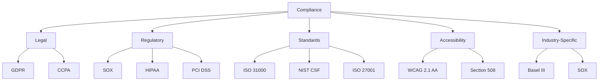

These non-functional requirements are designed to ensure that the ERM Experts Risk Management Platform meets high standards of performance, safety, security, quality, and compliance. They are aligned with the previously mentioned modern web technologies and frameworks, such as cloud-based infrastructure, responsive design, and the use of RESTful APIs. Implementation of these requirements will result in a robust, scalable, and secure platform that meets the needs of ERM Experts and their clients across various industries.

## DATA REQUIREMENTS

### DATA MODELS

The ERM platform will utilize a relational database management system (RDBMS) to store and manage data. The following entity-relationship diagram illustrates the core data model:

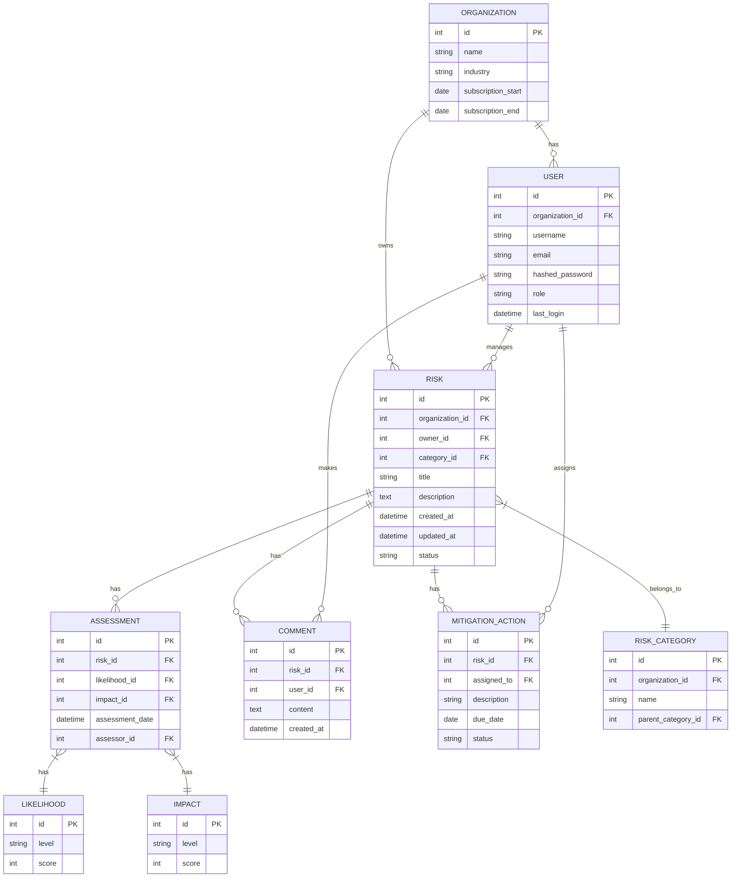

This data model supports the core functionalities of the ERM platform, including user management, risk categorization, assessment, and mitigation tracking.

### DATA STORAGE

The ERM platform will utilize a cloud-based storage solution to ensure scalability, reliability, and performance. The following specifications will be implemented:

1. Database Management System:
   - PostgreSQL 13 or later, hosted on a managed cloud service (e.g., Amazon RDS or Google Cloud SQL)
   - Utilize read replicas for improved performance and failover capabilities

2. Data Retention:
   - Active data: Retained for the duration of the client's subscription plus 30 days
   - Archived data: Retained for 7 years to comply with various regulatory requirements
   - Implement a data lifecycle management policy to automatically archive and delete data based on retention rules

3. Redundancy:
   - Implement multi-region database clusters for high availability
   - Use synchronous replication for critical data to ensure zero data loss in case of failover

4. Backup:
   - Daily automated full backups
   - Continuous incremental backups with point-in-time recovery capability
   - Retain backups for 30 days
   - Regularly test backup restoration process to ensure data integrity

5. Recovery:
   - Implement automated failover mechanisms with a Recovery Time Objective (RTO) of 5 minutes
   - Maintain a Recovery Point Objective (RPO) of 1 minute using continuous replication
   - Develop and regularly test a comprehensive Disaster Recovery (DR) plan

6. Scalability:
   - Implement database sharding for organizations with over 1 million risk entries
   - Utilize caching mechanisms (e.g., Redis) to reduce database load for frequently accessed data
   - Implement auto-scaling for database resources based on load metrics

### DATA PROCESSING

The ERM platform will implement robust data processing mechanisms to ensure data integrity, security, and efficient operations. The following measures will be put in place:

1. Data Security:
   - Encrypt data at rest using AES-256 encryption
   - Implement TLS 1.3 for all data in transit
   - Use parameterized queries to prevent SQL injection attacks
   - Implement row-level security in the database for multi-tenant data isolation
   - Apply data masking for sensitive information in non-production environments

2. Data Validation:
   - Implement server-side input validation for all data entry points
   - Use database constraints to enforce data integrity rules
   - Implement data type checking and sanitization to prevent malformed data

3. Data Transformation:
   - Use ETL (Extract, Transform, Load) processes for bulk data imports
   - Implement data normalization techniques to ensure consistency across the platform

4. Audit Trail:
   - Maintain a comprehensive audit log of all data modifications
   - Store audit logs in a separate, append-only database table

5. Real-time Processing:
   - Implement event-driven architecture using message queues (e.g., RabbitMQ) for asynchronous processing of risk assessments and notifications

6. Batch Processing:
   - Schedule nightly batch jobs for data aggregation and report generation
   - Use parallel processing techniques for large-scale data operations

The following data flow diagram illustrates the high-level data processing within the ERM platform:

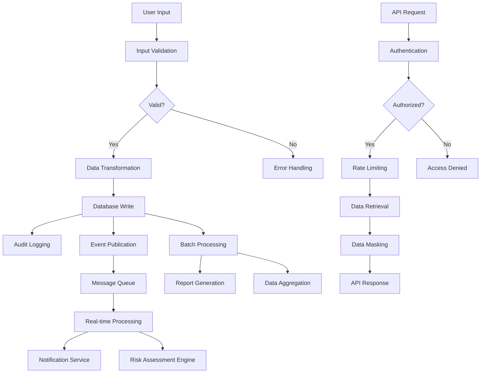

This data flow ensures that all data entering and leaving the system is properly validated, secured, and processed according to the platform's requirements. The combination of real-time and batch processing allows for efficient handling of both immediate user interactions and resource-intensive background tasks.

By implementing these data requirements, the ERM platform will provide a robust, scalable, and secure foundation for managing enterprise risk data across various organizations and industries.

# EXTERNAL INTERFACES

## USER INTERFACES

The ERM Experts Risk Management Platform will feature a responsive web-based user interface accessible through modern web browsers on both desktop and mobile devices. The interface will adhere to the following requirements:

1. Responsive Design
   - Adapt seamlessly to various screen sizes (desktop, tablet, mobile)
   - Maintain functionality and readability across devices

2. Intuitive Navigation
   - Clear menu structure for easy access to all platform features
   - Breadcrumb navigation for complex hierarchical structures

3. Dashboard
   - Customizable widgets for risk overview, recent activities, and key metrics
   - Drag-and-drop functionality for widget arrangement

4. Risk Input Forms
   - Dynamic forms with field validation and auto-save functionality
   - Support for file attachments and rich text formatting

5. Risk Visualization
   - Interactive heat maps with zoom and filter capabilities
   - Customizable charts and graphs for risk analysis

6. Reporting Interface
   - Report builder with drag-and-drop elements
   - Preview functionality for generated reports

7. User Profile and Settings
   - Easily accessible user profile management
   - Customizable notification preferences

8. Accessibility
   - Compliance with WCAG 2.1 AA standards
   - Support for keyboard navigation and screen readers

9. Theming
   - Light and dark mode options
   - Customizable color schemes for client branding

10. Responsive Data Tables
    - Sortable and filterable columns
    - Pagination and adjustable row display

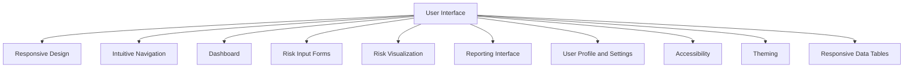

[Placeholder for UI mockups: Include wireframes or high-fidelity designs for key interface components such as the dashboard, risk input form, and heat map visualization.]

## SOFTWARE INTERFACES

The ERM Experts Risk Management Platform will interact with various software systems and components to provide a comprehensive risk management solution. The following software interfaces will be implemented:

1. Database Management System
   - Interface: PostgreSQL 13 or later
   - Purpose: Store and manage all risk-related data, user information, and system configurations
   - Requirements:
     - Support for ACID transactions
     - Ability to handle concurrent connections (minimum 1000)
     - Support for full-text search and JSON data types

2. Authentication and Authorization
   - Interface: OAuth 2.0 and OpenID Connect
   - Purpose: Secure user authentication and authorization
   - Requirements:
     - Support for multi-factor authentication
     - Integration with popular identity providers (e.g., Google, Microsoft Azure AD)

3. Email Service
   - Interface: SMTP with TLS encryption
   - Purpose: Send notifications, alerts, and system communications
   - Requirements:
     - Support for email templates
     - Delivery tracking and bounce handling

4. File Storage
   - Interface: Amazon S3 or compatible object storage API
   - Purpose: Store uploaded documents and generated reports
   - Requirements:
     - Secure access control
     - Versioning support
     - Integration with content delivery network (CDN) for fast access

5. Analytics and Logging
   - Interface: ELK Stack (Elasticsearch, Logstash, Kibana) or compatible log management system
   - Purpose: Collect and analyze system logs and user activity data
   - Requirements:
     - Real-time log ingestion and processing
     - Customizable dashboards for system monitoring

6. External API
   - Interface: RESTful API with OpenAPI 3.0 specification
   - Purpose: Allow integration with third-party systems and client applications
   - Requirements:
     - JSON data format
     - OAuth 2.0 authentication
     - Rate limiting and usage monitoring

7. Reporting Engine
   - Interface: Custom API or integration with business intelligence tools (e.g., Power BI, Tableau)
   - Purpose: Generate complex reports and data visualizations
   - Requirements:
     - Support for various output formats (PDF, Excel, CSV)
     - Scheduled report generation

8. Caching Layer
   - Interface: Redis or compatible in-memory data store
   - Purpose: Improve performance by caching frequently accessed data
   - Requirements:
     - Support for various data structures (strings, lists, hashes)
     - Pub/sub messaging for real-time updates

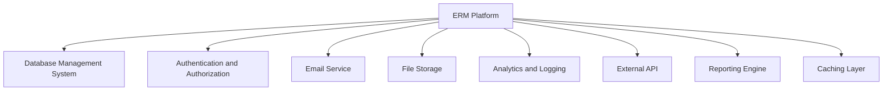

## COMMUNICATION INTERFACES

The ERM Experts Risk Management Platform will utilize various communication interfaces to ensure secure and efficient data exchange between system components and external entities. The following communication interfaces will be implemented:

1. HTTPS
   - Protocol: TLS 1.3 or later
   - Purpose: Secure all web-based communications between clients and the server
   - Requirements:
     - Use of valid SSL/TLS certificates
     - Support for perfect forward secrecy
     - Regular security audits and updates

2. WebSocket
   - Protocol: WSS (WebSocket Secure)
   - Purpose: Enable real-time updates and notifications in the user interface
   - Requirements:
     - Secure authentication for WebSocket connections
     - Efficient handling of concurrent connections
     - Automatic reconnection in case of network issues

3. RESTful API
   - Protocol: HTTPS
   - Data Format: JSON
   - Purpose: Provide a standardized interface for external system integration
   - Requirements:
     - Versioning support (e.g., /api/v1/, /api/v2/)
     - Comprehensive error handling and status codes
     - Rate limiting and usage monitoring

4. Database Connection
   - Protocol: PostgreSQL wire protocol with SSL encryption
   - Purpose: Secure communication between the application server and the database
   - Requirements:
     - Connection pooling for efficient resource utilization
     - Encrypted connections to protect sensitive data
     - Robust error handling and connection management

5. Email Communication
   - Protocols: SMTP with STARTTLS, IMAP for email fetching (if required)
   - Purpose: Send notifications and alerts to users
   - Requirements:
     - Support for DKIM and SPF for improved deliverability
     - Secure handling of email credentials
     - Queue management for reliable email delivery

6. File Transfer
   - Protocol: HTTPS or AWS S3 API
   - Purpose: Secure upload and download of documents and reports
   - Requirements:
     - Support for large file transfers (up to 100MB)
     - Resumable uploads for improved reliability
     - Content-type validation to prevent malicious file uploads

7. Single Sign-On (SSO)
   - Protocols: SAML 2.0, OAuth 2.0
   - Purpose: Enable seamless authentication with client identity providers
   - Requirements:
     - Support for multiple identity providers
     - Secure handling and validation of authentication tokens
     - User provisioning and de-provisioning capabilities

8. Webhooks
   - Protocol: HTTPS
   - Data Format: JSON
   - Purpose: Allow real-time notifications to external systems for specific events
   - Requirements:
     - Configurable event types and payload structures
     - Retry mechanism for failed webhook deliveries
     - Secure webhook authentication (e.g., HMAC signatures)

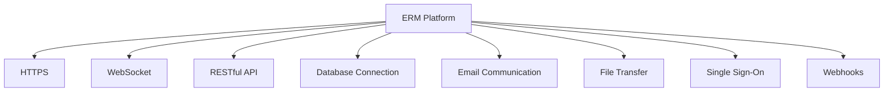

These communication interfaces ensure that the ERM Experts Risk Management Platform can securely and efficiently exchange data with users, external systems, and internal components. By adhering to industry-standard protocols and best practices, the platform will maintain high levels of security, performance, and interoperability.

# APPENDICES

## GLOSSARY

- **Enterprise Risk Management (ERM)**: A comprehensive approach to identifying, assessing, and managing potential risks that could affect an organization's ability to achieve its objectives.

- **Risk Register**: A centralized repository of identified risks, their assessments, and mitigation strategies.

- **Heat Map**: A visual representation of risks plotted on a matrix, typically using color coding to indicate the severity or priority of each risk.

- **Mitigation Action**: A specific task or strategy implemented to reduce the likelihood or impact of an identified risk.

- **Risk Owner**: An individual or group responsible for managing a specific risk, including its assessment and mitigation efforts.

- **Likelihood**: The probability of a risk occurring, often rated on a scale (e.g., low, medium, high).

- **Impact**: The potential consequences or effects of a risk if it were to occur, typically rated on a scale (e.g., minor, moderate, severe).

- **Risk Appetite**: The level of risk an organization is willing to accept in pursuit of its objectives.

- **Key Risk Indicator (KRI)**: A metric used to measure and monitor specific risk factors over time.

- **Residual Risk**: The remaining risk after mitigation actions have been implemented.

## ACRONYMS

- **API**: Application Programming Interface
- **AWS**: Amazon Web Services
- **CCPA**: California Consumer Privacy Act
- **CI/CD**: Continuous Integration/Continuous Deployment
- **CSV**: Comma-Separated Values
- **GDPR**: General Data Protection Regulation
- **HIPAA**: Health Insurance Portability and Accountability Act
- **HTTPS**: Hypertext Transfer Protocol Secure
- **JSON**: JavaScript Object Notation
- **KPI**: Key Performance Indicator
- **MFA**: Multi-Factor Authentication
- **NIST**: National Institute of Standards and Technology
- **OAuth**: Open Authorization
- **PCI DSS**: Payment Card Industry Data Security Standard
- **PDF**: Portable Document Format
- **RBAC**: Role-Based Access Control
- **REST**: Representational State Transfer
- **SAML**: Security Assertion Markup Language
- **SLA**: Service Level Agreement
- **SOC**: System and Organization Controls
- **SOX**: Sarbanes-Oxley Act
- **SQL**: Structured Query Language
- **SSL**: Secure Sockets Layer
- **SSO**: Single Sign-On
- **TLS**: Transport Layer Security
- **UAT**: User Acceptance Testing
- **UI/UX**: User Interface/User Experience
- **WCAG**: Web Content Accessibility Guidelines

## ADDITIONAL REFERENCES

1. ISO 31000:2018 Risk Management Guidelines
   https://www.iso.org/standard/65694.html

2. COSO Enterprise Risk Management Framework
   https://www.coso.org/Pages/erm.aspx

3. NIST Risk Management Framework
   https://csrc.nist.gov/projects/risk-management/about-rmf

4. OWASP Top Ten Web Application Security Risks
   https://owasp.org/www-project-top-ten/

5. Cloud Security Alliance (CSA) Cloud Controls Matrix
   https://cloudsecurityalliance.org/research/cloud-controls-matrix/

6. GDPR Official Text
   https://gdpr-info.eu/

7. CCPA Official Text
   https://oag.ca.gov/privacy/ccpa

8. Web Accessibility Initiative (WAI) Guidelines
   https://www.w3.org/WAI/standards-guidelines/

9. PostgreSQL 13 Documentation
   https://www.postgresql.org/docs/13/index.html

10. React.js Documentation
    https://reactjs.org/docs/getting-started.html

11. Node.js Documentation
    https://nodejs.org/en/docs/

12. Express.js Documentation
    https://expressjs.com/

13. AWS Well-Architected Framework
    https://aws.amazon.com/architecture/well-architected/

14. Docker Documentation
    https://docs.docker.com/

15. Kubernetes Documentation
    https://kubernetes.io/docs/home/

These additional references provide valuable information on risk management standards, security best practices, relevant regulations, and technical documentation for the technologies and frameworks chosen for the ERM Experts Risk Management Platform. They serve as supplementary resources for both the development team and stakeholders involved in the project.