# INTRODUCTION

## SYSTEM OVERVIEW

The ERM Experts Risk Management Platform is a comprehensive, cloud-based solution designed to revolutionize how organizations handle enterprise risk management. This system provides a centralized platform for creating, updating, and overseeing risk registers across all levels of an organization. The platform is built using modern web technologies and follows a microservices architecture to ensure scalability, maintainability, and flexibility.

### Key Components

1. Web Application
   - Frontend: React.js with responsive design
   - Backend: Node.js with Express.js framework
   - API: RESTful architecture following OpenAPI 3.0 specifications

2. Database
   - Primary: PostgreSQL 13 or later
   - Caching: Redis for improved performance

3. Authentication and Authorization
   - OAuth 2.0 and OpenID Connect for secure authentication
   - Role-Based Access Control (RBAC) for fine-grained permissions

4. File Storage
   - Amazon S3 or compatible object storage for document management

5. Analytics and Logging
   - ELK Stack (Elasticsearch, Logstash, Kibana) for system monitoring and log analysis

6. Messaging and Real-time Updates
   - RabbitMQ for asynchronous processing
   - WebSocket for real-time client updates

7. Reporting Engine
   - Custom reporting module with integration capabilities for popular BI tools

8. External Integrations
   - RESTful API for third-party system integration
   - Webhook support for real-time event notifications

### System Architecture

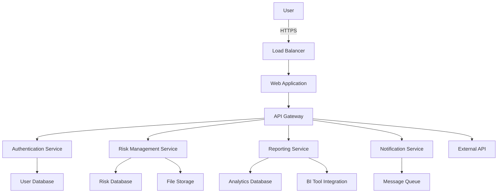

### Key Features

1. Risk Input and Categorization
   - Intuitive forms for risk data entry
   - Hierarchical risk categorization system
   - Bulk import/export functionality

2. Automated Risk Assessment
   - Configurable risk assessment matrices
   - Automated risk ranking based on likelihood and impact
   - Historical tracking of risk assessments

3. Dynamic Visualization
   - Interactive heat maps for risk prioritization
   - Customizable dashboards with real-time updates

4. Reporting and Analytics
   - Standard and custom report generation
   - Advanced analytics with filtering and drill-down capabilities

5. Collaboration Tools
   - Comment threads on individual risks
   - Task assignment for risk mitigation actions
   - Notification system for updates and deadlines

6. Integration Capabilities
   - RESTful API for data exchange
   - SSO integration
   - Webhook support for real-time notifications

7. Data Security and Compliance
   - End-to-end encryption
   - Comprehensive audit logging
   - Compliance with GDPR, CCPA, and other relevant regulations

### Deployment and Scalability

The ERM Experts Risk Management Platform is designed for cloud deployment, leveraging containerization technologies such as Docker and orchestration with Kubernetes. This approach ensures:

- Scalability to handle growing user bases and data volumes
- High availability through multi-region deployments
- Easy updates and maintenance through CI/CD pipelines
- Cost-effective resource utilization through auto-scaling

### User Interfaces

The platform provides a responsive web interface accessible through modern web browsers on both desktop and mobile devices. Key interface components include:

| Component | Description |
|-----------|-------------|
| Dashboard | Customizable overview of key risk metrics and recent activities |
| Risk Register | Interactive list of risks with filtering and sorting capabilities |
| Risk Detail View | Comprehensive view of individual risks with assessment history and mitigation actions |
| Heat Map | Visual representation of risks based on likelihood and impact |
| Report Builder | Interface for creating custom reports with drag-and-drop elements |
| Admin Panel | Configuration interface for system settings and user management |

This system overview provides a high-level understanding of the ERM Experts Risk Management Platform, its key components, architecture, and features. The platform is designed to be robust, scalable, and secure, meeting the complex needs of enterprise risk management across various industries and organization sizes.

# SYSTEM ARCHITECTURE

## PROGRAMMING LANGUAGES

The ERM Experts Risk Management Platform will utilize the following programming languages, chosen for their suitability to the project requirements, performance, and ecosystem support:

| Language | Purpose | Justification |
|----------|---------|---------------|
| JavaScript (ES6+) | Frontend development | - Widely supported by modern browsers<br>- Rich ecosystem of libraries and frameworks<br>- Enables dynamic and interactive user interfaces |
| TypeScript | Frontend and Backend development | - Adds static typing to JavaScript, improving code quality and maintainability<br>- Enhances developer productivity through better tooling and IDE support |
| Node.js | Backend development | - Allows for JavaScript on the server-side, enabling full-stack JavaScript development<br>- High performance and scalability for I/O-intensive operations<br>- Large ecosystem of packages via npm |
| SQL | Database queries and management | - Industry standard for relational database operations<br>- Powerful querying capabilities for complex data relationships |
| Python | Data processing and analytics | - Rich libraries for data analysis and machine learning (e.g., pandas, scikit-learn)<br>- Useful for creating data processing scripts and generating reports |
| Bash | DevOps and automation scripts | - Essential for writing deployment scripts and automating system tasks<br>- Widely supported across various operating systems |

## HIGH-LEVEL ARCHITECTURE DIAGRAM

The following diagram provides an overview of the ERM Experts Risk Management Platform's high-level architecture:

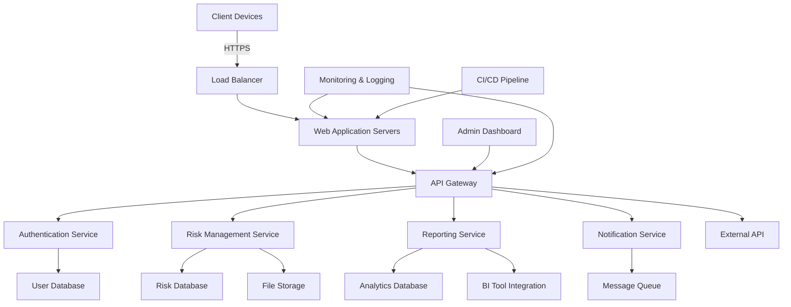

This architecture follows a microservices approach, allowing for scalability, maintainability, and flexibility in development and deployment.

## COMPONENT DIAGRAMS

### Web Application Component

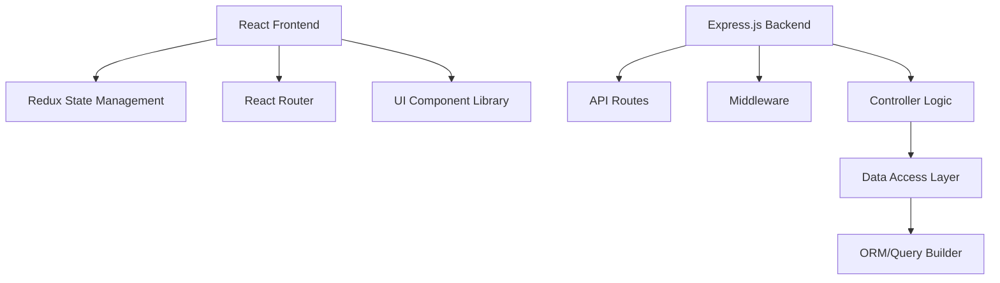

### Risk Management Service Component

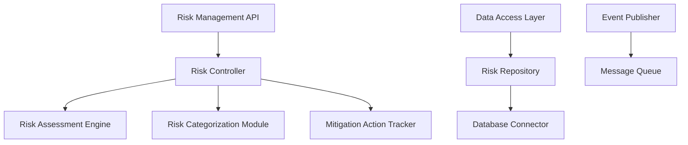

## SEQUENCE DIAGRAMS

### User Authentication Flow

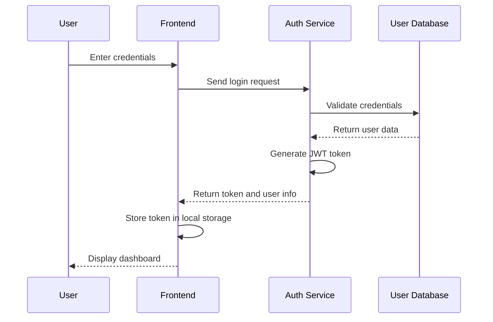

### Risk Assessment Process

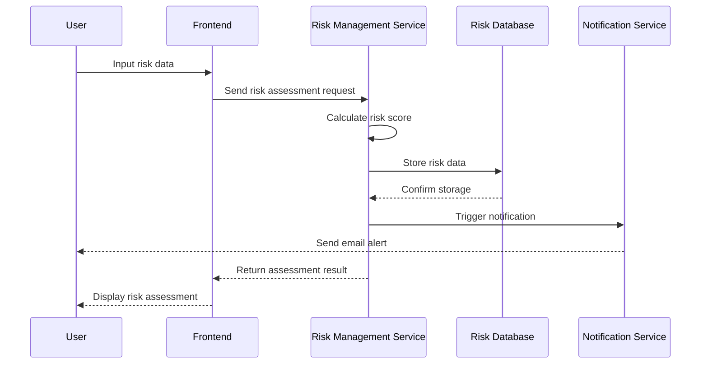

## DATA-FLOW DIAGRAM

The following diagram illustrates how information moves through the ERM Experts Risk Management Platform:

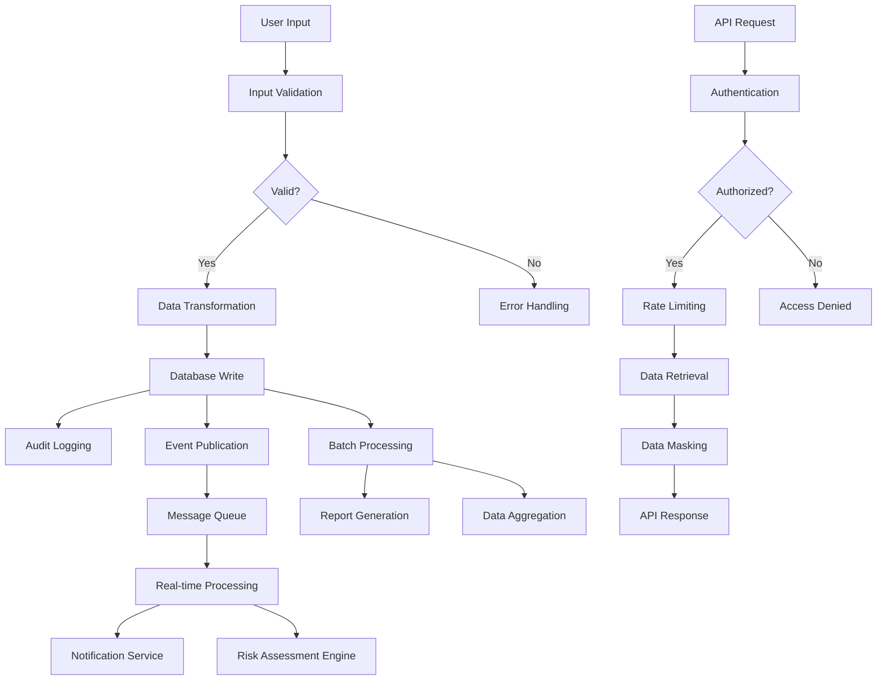

This data flow ensures that all information entering and leaving the system is properly validated, secured, and processed according to the platform's requirements. The combination of real-time and batch processing allows for efficient handling of both immediate user interactions and resource-intensive background tasks.

The system architecture described above provides a robust, scalable, and secure foundation for the ERM Experts Risk Management Platform. It leverages modern technologies and best practices to ensure high performance, maintainability, and flexibility for future enhancements.

# SYSTEM DESIGN

## PROGRAMMING LANGUAGES

The ERM Experts Risk Management Platform will utilize the following programming languages, chosen for their suitability to the project requirements, performance, and ecosystem support:

| Language | Purpose | Justification |
|----------|---------|---------------|
| JavaScript (ES6+) | Frontend development | - Widely supported by modern browsers<br>- Rich ecosystem of libraries and frameworks<br>- Enables dynamic and interactive user interfaces |
| TypeScript | Frontend and Backend development | - Adds static typing to JavaScript, improving code quality and maintainability<br>- Enhances developer productivity through better tooling and IDE support |
| Node.js | Backend development | - Allows for JavaScript on the server-side, enabling full-stack JavaScript development<br>- High performance and scalability for I/O-intensive operations<br>- Large ecosystem of packages via npm |
| SQL | Database queries and management | - Industry standard for relational database operations<br>- Powerful querying capabilities for complex data relationships |
| Python | Data processing and analytics | - Rich libraries for data analysis and machine learning (e.g., pandas, scikit-learn)<br>- Useful for creating data processing scripts and generating reports |
| Bash | DevOps and automation scripts | - Essential for writing deployment scripts and automating system tasks<br>- Widely supported across various operating systems |

## DATABASE DESIGN

The ERM platform will use PostgreSQL as the primary relational database management system. The database design will follow these principles:

1. Normalization: The database will be designed to the Third Normal Form (3NF) to minimize data redundancy and ensure data integrity.
2. Indexing: Appropriate indexes will be created to optimize query performance.
3. Partitioning: Large tables will be partitioned to improve query performance and manageability.

Here's a high-level overview of the core database tables:

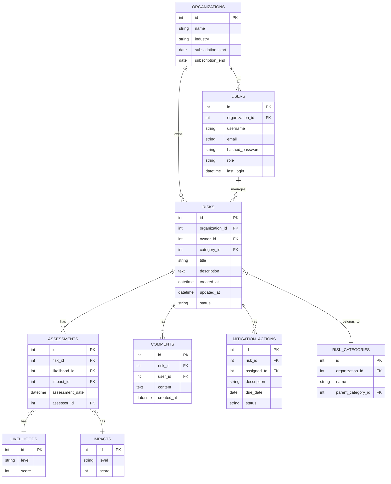

## API DESIGN

The ERM platform will expose a RESTful API for internal communication between the frontend and backend, as well as for integration with external systems. The API will follow these design principles:

1. RESTful architecture
2. JSON data format
3. OAuth 2.0 authentication
4. Versioning (e.g., /api/v1/)
5. Consistent error handling and status codes
6. Rate limiting and usage monitoring

Key API endpoints:

```
GET    /api/v1/risks
POST   /api/v1/risks
GET    /api/v1/risks/{id}
PUT    /api/v1/risks/{id}
DELETE /api/v1/risks/{id}

GET    /api/v1/assessments
POST   /api/v1/assessments
GET    /api/v1/assessments/{id}

GET    /api/v1/reports
POST   /api/v1/reports
GET    /api/v1/reports/{id}

GET    /api/v1/users
POST   /api/v1/users
GET    /api/v1/users/{id}
PUT    /api/v1/users/{id}
DELETE /api/v1/users/{id}
```

API documentation will be generated using OpenAPI 3.0 specifications, providing detailed information about endpoints, request/response formats, and authentication requirements.

## USER INTERFACE DESIGN

The ERM platform will feature a responsive web-based user interface built using React.js. The UI design will follow these principles:

1. Responsive design for desktop and mobile devices
2. Intuitive navigation and clear information hierarchy
3. Consistent branding and visual language
4. Accessibility compliance (WCAG 2.1 AA)

Key UI components:

1. Dashboard
   - Overview of key risk metrics
   - Recent activity feed
   - Quick access to frequently used functions

2. Risk Register
   - Filterable and sortable list of risks
   - Risk details view with assessment history
   - Risk input and editing forms

3. Heat Map
   - Interactive visualization of risks based on likelihood and impact
   - Drill-down capabilities for risk details

4. Reporting Interface
   - Report template selection
   - Custom report builder with drag-and-drop elements
   - Report preview and export options

5. User Management
   - User list with role assignments
   - User profile editing
   - Permission management interface

6. Settings and Configuration
   - Organization-specific settings
   - Risk category management
   - Integration configuration

Here's a high-level wireframe of the main dashboard:

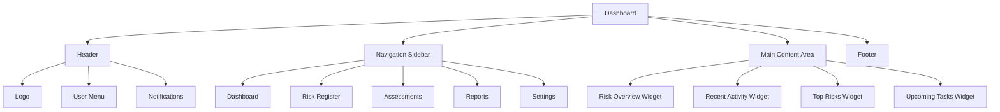

The user interface will be implemented using a component-based architecture, leveraging React.js and a UI component library (e.g., Material-UI or Ant Design) to ensure consistency and reusability across the application.

This system design provides a solid foundation for the ERM Experts Risk Management Platform, outlining the key technologies, database structure, API design, and user interface components. The design aligns with the previously mentioned modern web technologies and frameworks, ensuring a scalable, maintainable, and user-friendly solution.

# TECHNOLOGY STACK

## PROGRAMMING LANGUAGES

The ERM Experts Risk Management Platform will utilize the following programming languages:

| Language | Purpose | Justification |
|----------|---------|---------------|
| JavaScript (ES6+) | Frontend and Backend development | - Versatile language for full-stack development<br>- Large ecosystem and community support<br>- Excellent performance for web applications |
| TypeScript | Frontend and Backend development | - Adds static typing to JavaScript, improving code quality and maintainability<br>- Enhanced developer productivity through better tooling and IDE support |
| Python | Data processing and analytics | - Rich libraries for data analysis (pandas, numpy)<br>- Useful for creating data processing scripts and generating reports |
| SQL | Database queries and management | - Industry standard for relational database operations<br>- Powerful querying capabilities for complex data relationships |
| Bash | DevOps and automation scripts | - Essential for writing deployment scripts and automating system tasks<br>- Widely supported across various operating systems |

## FRAMEWORKS AND LIBRARIES

The following frameworks and libraries will be utilized in the development of the ERM platform:

### Frontend

| Framework/Library | Purpose |
|-------------------|---------|
| React.js | Core frontend framework for building user interfaces |
| Redux | State management for complex application states |
| React Router | Handling routing in the single-page application |
| Material-UI | UI component library for consistent and responsive design |
| Chart.js | Creating interactive charts and graphs for risk visualization |
| Axios | HTTP client for making API requests |

### Backend

| Framework/Library | Purpose |
|-------------------|---------|
| Node.js | Runtime environment for server-side JavaScript |
| Express.js | Web application framework for Node.js |
| Passport.js | Authentication middleware for Node.js |
| Sequelize | ORM for database interactions |
| Jest | Testing framework for unit and integration tests |
| Winston | Logging library for application and error logging |

### Data Processing

| Framework/Library | Purpose |
|-------------------|---------|
| pandas | Data manipulation and analysis |
| numpy | Numerical computing for advanced risk calculations |
| scikit-learn | Machine learning library for predictive risk modeling |

## DATABASES

The ERM platform will employ the following database systems:

| Database | Purpose |
|----------|---------|
| PostgreSQL 13+ | Primary relational database for storing structured data |
| Redis | In-memory data structure store for caching and real-time features |
| Elasticsearch | Full-text search and analytics engine for log management and advanced searching capabilities |

## THIRD-PARTY SERVICES

The following external services and APIs will be integrated into the ERM platform:

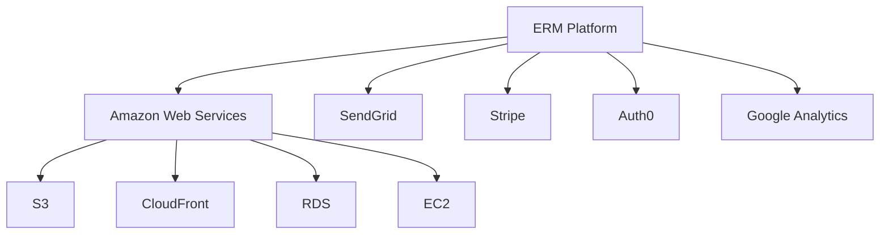

| Service | Purpose |
|---------|---------|
| Amazon Web Services (AWS) | Cloud infrastructure provider |
| AWS S3 | Object storage for file uploads and backups |
| AWS CloudFront | Content Delivery Network (CDN) for fast global content delivery |
| AWS RDS | Managed PostgreSQL database service |
| AWS EC2 | Compute instances for application hosting |
| SendGrid | Email delivery service for notifications and alerts |
| Stripe | Payment processing for subscription management |
| Auth0 | Identity and access management service for SSO and social logins |
| Google Analytics | Web analytics for user behavior tracking and reporting |

This technology stack leverages modern, scalable, and widely-supported technologies that align with the previously mentioned architectural decisions and non-functional requirements. The combination of these technologies will enable the development of a robust, performant, and maintainable ERM platform.

# SECURITY CONSIDERATIONS

## AUTHENTICATION AND AUTHORIZATION

The ERM Experts Risk Management Platform will implement a robust authentication and authorization system to ensure secure access and appropriate permissions for all users.

### Authentication

1. Multi-factor Authentication (MFA)
   - Implement MFA for all user accounts
   - Support various second factors:
     - Time-based One-Time Passwords (TOTP)
     - SMS-based codes
     - Push notifications to mobile devices
     - Hardware security keys (e.g., YubiKey)

2. Single Sign-On (SSO)
   - Support SAML 2.0 and OAuth 2.0 protocols for SSO integration
   - Allow integration with popular identity providers (e.g., Azure AD, Google Workspace, Okta)

3. Password Policies
   - Enforce strong password requirements:
     - Minimum 12 characters
     - Combination of uppercase, lowercase, numbers, and special characters
     - Password history to prevent reuse of recent passwords
   - Implement account lockout after 5 failed login attempts
   - Require password changes every 90 days

4. Session Management
   - Use secure, HttpOnly, and SameSite cookies for session tokens
   - Implement session timeout after 30 minutes of inactivity
   - Provide option for users to view and terminate active sessions

### Authorization

1. Role-Based Access Control (RBAC)
   - Implement fine-grained RBAC with predefined roles and custom role creation
   - Default roles: Admin, Risk Manager, Department Head, Risk Owner, Auditor, Read-Only User

2. Principle of Least Privilege
   - Assign minimum necessary permissions to each role
   - Implement time-based access for temporary elevated privileges

3. API Authentication
   - Use JWT (JSON Web Tokens) for API authentication
   - Implement token expiration and refresh mechanisms

4. Audit Logging
   - Log all authentication and authorization events
   - Include details such as user ID, IP address, timestamp, and action performed

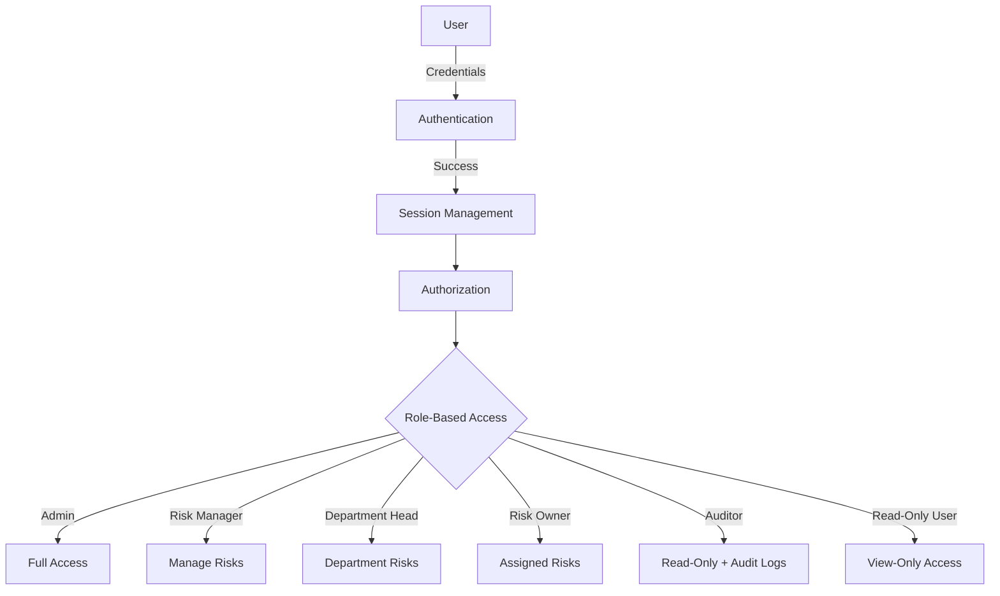

## DATA SECURITY

The ERM platform will implement multiple layers of data security to protect sensitive information throughout its lifecycle.

1. Encryption at Rest
   - Use AES-256 encryption for all data stored in the database
   - Implement transparent data encryption (TDE) for the PostgreSQL database
   - Encrypt all files stored in the object storage (e.g., AWS S3) using server-side encryption

2. Encryption in Transit
   - Use TLS 1.3 for all data transmissions
   - Implement HSTS (HTTP Strict Transport Security) to prevent downgrade attacks
   - Use secure WebSocket connections (WSS) for real-time communications

3. Key Management
   - Utilize a dedicated key management service (e.g., AWS KMS, HashiCorp Vault)
   - Implement regular key rotation (every 90 days)
   - Use separate encryption keys for different data categories

4. Data Masking and Anonymization
   - Implement data masking for sensitive information in non-production environments
   - Use anonymization techniques for reporting and analytics to protect individual privacy

5. Data Loss Prevention (DLP)
   - Implement DLP policies to prevent unauthorized data exfiltration
   - Monitor and alert on suspicious data access patterns

6. Secure Data Deletion
   - Implement secure data wiping procedures for data deletion requests
   - Use crypto-shredding techniques for efficient, secure deletion of encrypted data

7. Database Security
   - Implement row-level security in PostgreSQL for multi-tenant data isolation
   - Use parameterized queries to prevent SQL injection attacks
   - Regularly update and patch the database management system

| Data Security Measure | Implementation |
|-----------------------|-----------------|
| Encryption at Rest | AES-256, TDE for PostgreSQL, S3 server-side encryption |
| Encryption in Transit | TLS 1.3, HSTS, WSS |
| Key Management | AWS KMS or HashiCorp Vault, 90-day rotation |
| Data Masking | Production data masked in non-prod environments |
| DLP | Monitoring and alerting on suspicious access |
| Secure Deletion | Crypto-shredding, secure wiping procedures |
| Database Security | Row-level security, parameterized queries |

## SECURITY PROTOCOLS

The ERM platform will adhere to industry-standard security protocols and best practices to maintain a robust security posture.

1. Secure Development Lifecycle (SDL)
   - Implement security requirements gathering in the planning phase
   - Conduct regular security training for development team members
   - Perform threat modeling for new features and architectural changes
   - Implement secure coding practices and guidelines
   - Conduct code reviews with a focus on security

2. Vulnerability Management
   - Perform regular automated vulnerability scans of the application and infrastructure
   - Conduct annual penetration testing by a third-party security firm
   - Implement a responsible disclosure program for external security researchers
   - Maintain a vulnerability management process with defined SLAs for remediation

3. Patch Management
   - Implement automated patch management for all system components
   - Conduct regular security updates for all dependencies
   - Maintain a separate patching schedule for critical security updates

4. Incident Response
   - Develop and maintain an incident response plan
   - Conduct regular incident response drills and tabletop exercises
   - Implement automated alerting for potential security incidents
   - Establish a security incident response team (SIRT) with defined roles and responsibilities

5. Security Monitoring and Logging
   - Implement centralized log management using the ELK stack (Elasticsearch, Logstash, Kibana)
   - Use SIEM (Security Information and Event Management) for real-time security event correlation and analysis
   - Implement automated alerts for suspicious activities
   - Retain security logs for a minimum of one year

6. Access Control and Network Security
   - Implement network segmentation to isolate critical components
   - Use a Web Application Firewall (WAF) to protect against common web attacks
   - Implement IP whitelisting for administrative access
   - Use VPN for remote access to production environments

7. Third-party Security
   - Conduct security assessments of all third-party integrations and vendors
   - Implement a vendor risk management program
   - Require SOC 2 Type II or equivalent compliance for critical vendors

8. Compliance and Auditing
   - Conduct annual security audits to ensure compliance with industry standards (e.g., ISO 27001, SOC 2)
   - Perform regular internal security audits
   - Maintain documentation of all security controls and processes

```mermaid
graph TD
    A[Security Protocols] --> B[Secure Development Lifecycle]
    A --> C[Vulnerability Management]
    A --> D[Patch Management]
    A --> E[Incident Response]
    A --> F[Security Monitoring and Logging]
    A --> G[Access Control and Network Security]
    A --> H[Third-party Security]
    A --> I[Compliance and Auditing]
    B --> J[Security Requirements]
    B --> K[Security Training]
    B --> L[Threat Modeling]
    B --> M[Secure Coding Practices]
    B --> N[Code Reviews]
    C --> O[Vulnerability Scans]
    C --> P[Penetration Testing]
    C --> Q[Responsible Disclosure]
    E --> R[Incident Response Plan]
    E --> S[IR Drills]
    E --> T[Automated Alerting]
    F --> U[Centralized Logging]
    F --> V[SIEM]
    F --> W[Log Retention]
    G --> X[Network Segmentation]
    G --> Y[WAF]
    G --> Z[IP Whitelisting]
```

These security considerations provide a comprehensive approach to ensuring the confidentiality, integrity, and availability of the ERM Experts Risk Management Platform. By implementing these measures, the platform will maintain a strong security posture and protect sensitive risk management data for all clients.